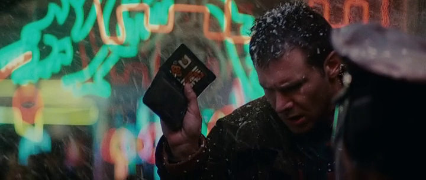

# Blade Runner ID Card Generator



## What is this

A tool that lets you build your own ID card in the style of Rick Deckard's from _Blade Runner_. Built with HTML5 Canvas and TypeScript.

## Why is this

I liked the imagery and wanted a higher quality version, and also I wanted to use TypeScript in a project. I also thought it'd be a fun design challenge to build an ID card that can be rendered at different sizes and aspect ratios.

## Inspiration

- _Blade Runner_ (1982)
- Design is based on [this image](app/assets/example.jpg) by ["Staar" on propsummit.com](http://propsummit.com/viewtopic.php?p=27107#27107) (which is based on [another by "The Loyalizer"](http://propsummit.com/viewtopic.php?p=26827#26827))
- The "Spinner" font is courtesy of Phil Steinschneider, available to [download for free from his website](http://www.steinschneider.com/bladerunner/BRFont.htm)

## Try it out

[Visit this page](http://rikkit.github.io/brid) - TODO set up this page

## Build it yourself

Install node.js, then:

```
npm install -g brunch
npm install -g typings
npm install
typings install

brunch watch --server # visit http://localhost:3333 
```
